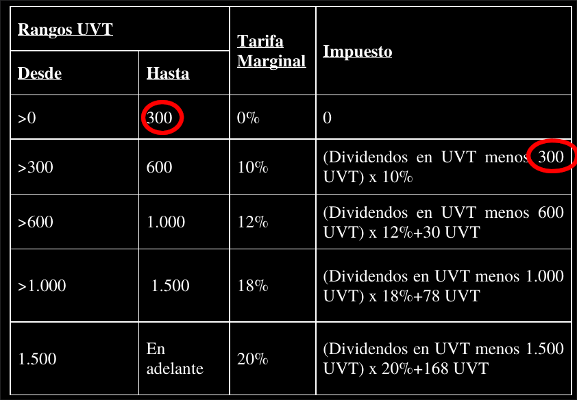
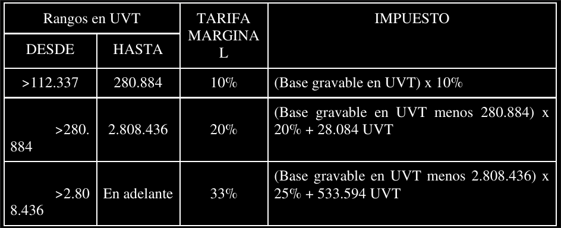
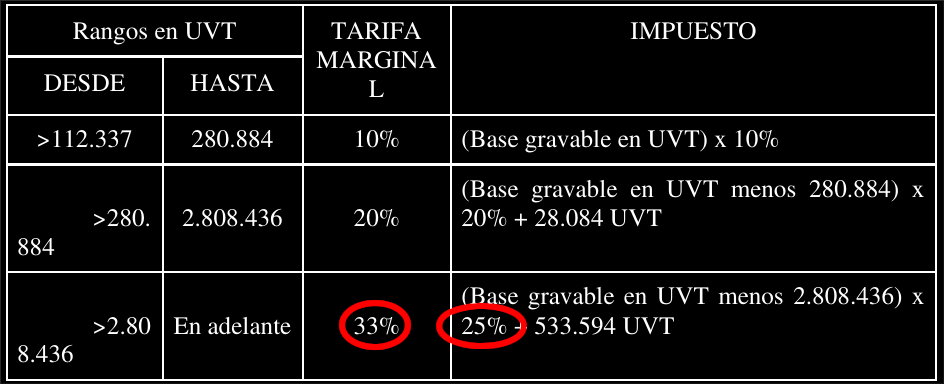

I discovered the inconsistencies in the process of translating the law to Python code.


# The dividend tax schedule

Let's start with the part of the law where I found no inconsistencies, which is the dividend tax. Here's what that looks like in the proposal:


What that says is that if someone's dividend income is less than 300 uvts, they pay no dividend tax. If it's not less than 300 but it's less than 600 uvts, then they pay 10% tax on the portion of their dividend income in excess of 300 uvts. If their dividend income is not less than 600 uvt but it's less than 1000 uvt, they pay 18% on the portion above 600, and they also pay 30 uvt for the first 600. Etc.

There are a couple important patterns in that. First, notice how the 300 in the "hasta" column of the first row is subtracted from income in the formula ("impuesto") column of the second row:

.

Similarly, the 600 from the second row appears in the formula for the third row, etc. This pattern is common to tax schedules. Since each peso earned should be taxed by exactly one rate (maybe zero), the pesos that were taxed at earlier rates are subtracted from income when the next rate is applied.

The second pattern is a little more complicated, but still simple: If you plug in the maximum amount of income that could be taxed in any row, the result is the amount that is added to someone's taxes in the next row. For instance:


In the second row, if you plug in 600, you get 30, and 30 is the amount added in the third row. (In the first row, if you plug in 300, you get 0, which is why nothing is added in the formula for the second row.)

The dividend tax proposed follows these rules perfectly. The others do not.


# The inheritance tax

The inheritance schedule comes with a helpful column indicating the marginal tax rate. It's the one labeled "Tarifa Marginal":



There are two problems with this table. The first is that the biggest inheritances are not in fact being taxed at a 33% rate, as suggested by the "Tarifa Marginal" column, but rather just 25%:



The second is that the `112337` from the first row should be subtracted from `x` in the second row. Without this, we have the strange result that if someone inherits `112336` UVTs, they pay no inheritance tax, but if they inherit `112338` UVTs, they lose 10% of their entire inheritance to taxes.


# The wealth tax (in progress)

```
def wealthTax_intended(x):
  return             (0                                if x <   84253
    else             ( (x -   84253)*0.01              if x <  140422
      else           ( (x -  140422)*0.015 + 561.69    if x <  280844
        else         ( (x -  280844)*0.02  + 2668.0198 if x <  702109
          else       ( (x -  702109)*0.025 + 11093.319 if x < 1404218
            else     ( (x - 1404218)*0.03  + 28646.043 if x < 2106327
              else   ( (x - 2106327)*0.035 + 49709.313 if x < 2808437
                else ( (x - 2808437)*0.04  + 74283.164 ) ) ) ) ) ) ) )

def wealthTax_written(x):
  return             (  0                            if x <   84253
    else             ( (x -    13500 )*0.01          if x <  140422
      else           ( (x -   140422 )*0.015 +  1269 if x <  280844
        else         ( (x -   280843 )*0.02  +  3376 if x <  702109
          else       ( (x -   969796 )*0.025 + 11801 if x < 1404218
            else     ( (x -  1685061 )*0.03  + 29354 if x < 2106327
              else   ( (x -  2106327 )*0.035 + 50417 if x < 2808437
                else ( (x - 14042183 )*0.04  + 74990 ) ) ) ) ) ) ) )
```
